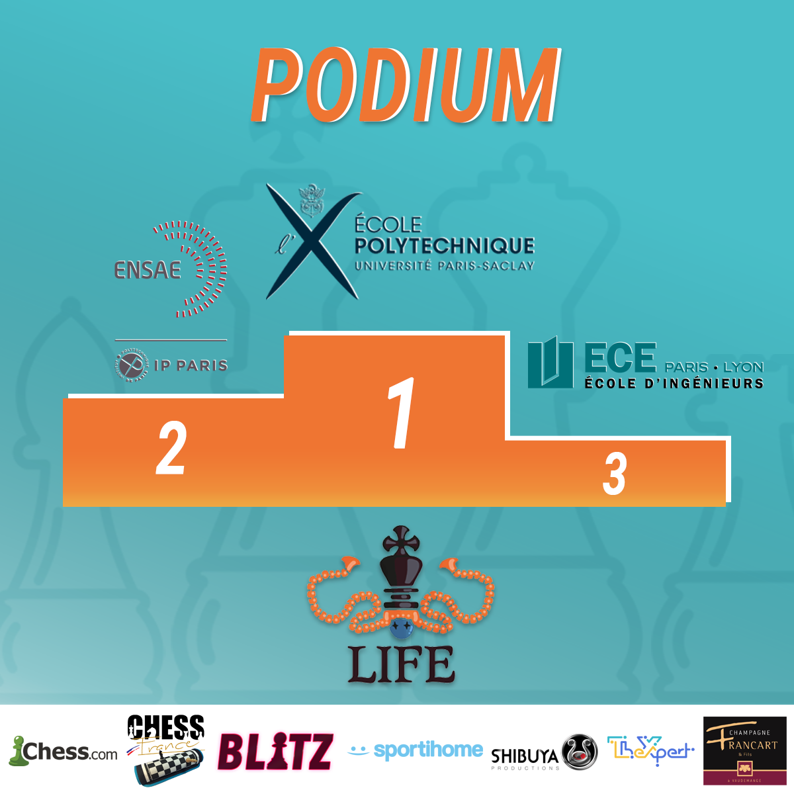

## Le retour de la LIFE !!

Suite au succès des deux premières éditions, nous ne pouvions pas nous arrêter là, nous voilà donc de retour avec une troisième édition de la LIFE.  
Pour préparer cette nouvelle édition, nous avons tenu compte de vos retours pour améliorer le format et voici le résultat de ce travail dans les grandes lignes :

- Des qualifications sur 4 semaines via 4 tournois indépendants au format suisse
- Des équipes de 4 à 5 joueurs
- Plus aucune limite au nombre d'équipes, que ce soit le nombre au total mais aussi le nombre par école
- Des prix individuels pour les meilleurs joueurs et les meilleures joueuses lors des phases de qualification

Pour plus de détails vous pouvez aller regarder le règlement qui se trouve dans la barre juste à droite de cet article et si vous avez des questions vous pouvez les poser à cette adresse : [contact@life-echecs.org](mailto:contact@life-echecs.org?subject=Question LIFE).

## Résultats de la LIFE

Après plusieurs mois de compétition qui ont vu s'affronter 32 écoles d'ingénieurs venues de toute la France, la **LIFE** s'est terminée Lundi 15/02 sur une victoire de l'équipe de Polytechnique. L'ENSAE et l'ECE Paris viennent compléter ce magnifique podium.  
Merci à tous les joueurs et à toutes les personnes qui ont suivi l'événement ainsi qu'à nos sponsors, on se retrouve l'année prochaine pour la troisième édition !

## Présentation du tournoi

Bienvenue sur le site de la **L**igue **I**ngénieure **F**rançaise d'**E**checs.
 Cette compétition, dont la toute première édition aura lieu entre Novembre 2020 et Février 2021, est organisée par le <a href="https://bnei.fr" target="_blank">BNEI</a> sur l'initiative du club d'échecs de l'ENSEEIHT .

Elle se déroulera en ligne et opposera 32 écoles d'ingénieurs venues de toute la France au travers de matchs en équipes de 4. Les affrontements se feront selon différents formats : Rapide, Blitz et même Bughouse afin de déterminer quelles équipes se qualifieront pour les phases finales.

Les parties seront jouées sur la plateforme <a href="https://chess.com" target="_blank">Chess.com</a> et elles seront aussi visionnables sur cette même plateforme via des liens qui seront fournis dans la page Calendrier.
 Pour les phases finales elles seront directement retransmises et commentées sur la chaîne Twitch <a href="https://twitch.tv/chesscomfr"> chesscomfr.</a> 

Vous souhaitez représenter la LIFE dans votre école ? Le formulaire dans la section <em>Documents Importants</em> est fait pour cela ! Et si vous souhaitez juste vous inscrire vous pouvez envoyez un mail à jules.morata@bnei.fr.

Vous pourrez aussi retrouver des publications régulières sur l'événement Facebook associé.

N'hésitez pas à aller jeter un oeil à la page sponsor pour découvrir les entreprises qui nous aident à rendre ce tournoi possible et qui pourraient vous intéresser.

Pour le moment le site est encore en construction, du contenu y sera bientôt ajouté.

</article>

<!-- Sidebar -->
<article class="sidebar col-lg-4 col-12">
<h2 class="sidebar_title text-center"> Documents importants </h2>
<ul>
<li><a href="files/R_glement_LIFE.pdf" target="_blank">Règlement du tournoi</a> 

<em>Dernière mise à jour: 18/02/2022</em>

</li>
<li><a href="files/politique_confidentialite.pdf" target="_blank">Politique de confidentialité</a></li>
<li><a href="https://fb.me/e/2VmSgJI6q" target="_blank">Evénement Facebook pour les annonces hebdomadaires</a></li>
</ul>
</article>

